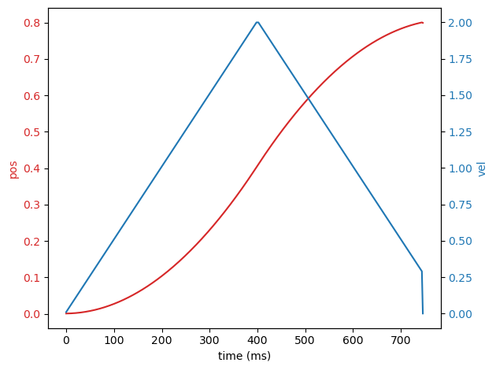
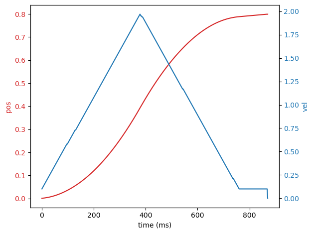
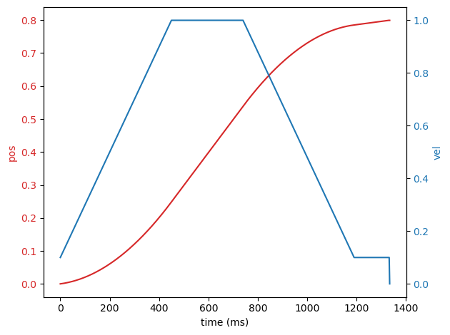

### Configuration of the motor

The MotorParams struct holds all the parameters for the MotorMover class:

 - `group_name`: the group in which the joint relative to the motor is.
 - `joint_name`: the name of the joint relative to the motor.
 - `lower_limit`: lower limit in radians for the joint position.
 - `upper_limit`: upper limit in radians for the joint position.
 - `vel_limit`: velocity limit for the joint (rad/s)
 - `acc_limit`: acceleration limit for the joint (rad2/s), the controller will attempt to reach vel_limit without exceeding this acceleration.
 - `min_vel`: minimum velocity at which the motor will start and end its motion, it is assumed the motor can start and stop almost instantly at this speed even when exceeding acceleration limits.
 - `min_vel_region`: With this value it is possible to specify a percentage of the path before reaching the target position that will be executed at minimum velocity.
 - `tolerance`: distance within which the target position is considered reached.
 - `ctrl_rate`: frequency at which the controller will publish positions and velocities for the motor (Hz).

Here are some examples of how changing vel_limit, acc_limit, min_vel and min_vel_region will affect motion, all tests are performed with fake controller and 500Hz ctrl_rate:

    vel_limit=2.0
    acc_limit=5.0
    min_vel=0.0
    min_vel_region=0.0

    

    vel_limit=2.0
    acc_limit=5.0
    min_vel=0.1
    min_vel_region=0.02
    

    

    vel_limit=1.0
    acc_limit=2.0
    min_vel=0.1
    min_vel_region=0.02
    

    

